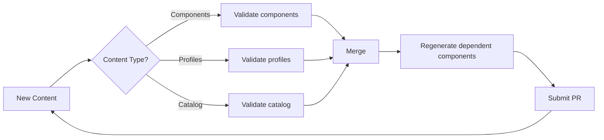
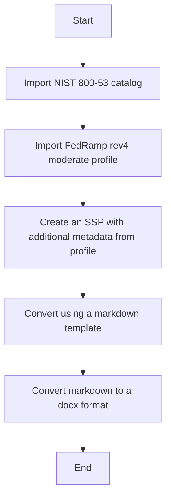

# trestle-demo

This demo repository illustrates how to use [compliance-trestle](https://ibm.github.io/compliance-trestle/) to enable continuous compliance workflows.

## Authoring

This demo shows the authoring workflows using the `generate-edit-assemble` steps recommended by the `compliance-trestle` documentation.

What does `generate-edit-assemble` mean?

The first step in finishing edits on OSCAL content is to run commands to generate markdown from the OSCAL models.

The following commands can be run to generate this:

- `make regenerate-catalogs`
- `make regenerat-profiles`
- `make regenerate-cd`
- To regenerate all: `make regenerate`

To generate an SSP from a profile and component definitions, use the following command:

`trestle author ssp-generate --profile profile_name --compdefs "compdef_a,compdef_b" --output markdown/my_ssp`

The generated markdown is located in `markdown` directory. Each control is stored in its own file, and it is these files that should be edited.

When the edits are finished, the markdown can be reassembled into the OSCAL models using the commands listed below.:

- `make assemble-catalogs`
- `make assemble-profiles`
- `make assemble-cd`
- To assemble all: `make assemble`

For more information on the `trestle` commands used, please see the `compliance-trestle` [documentation](https://ibm.github.io/compliance-trestle/tutorials/ssp_profile_catalog_authoring/ssp_profile_catalog_authoring/) around authoring.

### Demo Authoring CI Workflow

Workflows can be demonstrated by using `make` targets.

To test markdown generation, edit them, and then reassemble them using the commands outlined above.

When pull requests are submitted, certain validation pipelines will be run based on the path that edited content is located in to ensure markdown and json content is in sync and all OSCAL documents are valid.

Once the content has been merged, a pipeline will be started to regenerate dependent components and submit PRs as needed.
This enables pull requests to include specific OSCAL models, and dependent changes can be detected and submitted into a new pull request for review by other personas.

This repository does not use CODEOWNERS to delegate permissions to certain groups, but that is a solution for allowing the 
different personas control of their applicable OSCAL content.



## Evidence Collection

TBD

## Reporting

TBD

## Required Components

- [`docker`](https://docs.docker.com/get-docker/) or [`podman`](https://podman.io/getting-started/installation)
- `make`
- `git`

## Using the Sandbox Environment

Using `make sandbox-run`: Using the container environment ensures `compliance-trestle` and other required dependencies are
available for use. Currently, this container image must be built locally using `make demo-build`, but making a remote image reference available
is part of the roadmap.

#### Getting Started

Run the following commands to access the trestle workspace with the required dependencies:

```bash
make demo-build
make sandbox-run
cd trestle-workspace
```


## Workflows

### FedRAMP SSP Authoring

#### Diagram



#### Usage

To use the container with all the required dependencies, run `make demo-build` and `make sandbox-run`

To move to the workspace run `cd trestle-workspace`

Run `make generate-ssp-word` to run the entire workflow. This will generate a markdown SSP and convert it to the docx format.
To just generate the markdown run `make generate-ssp-markdown`

If starting from scratch or testing changes to the SSP:

Run `make bootstrap-workspace` to import the NIST catalog and FedRamp profile.
Run `make generate-fedramp-ssp` to generate the SSP markdown files under `markdown/system-security-plans`

> If changes are made to the SSP markdown, run `make assemble-ssps`


