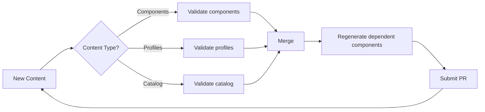
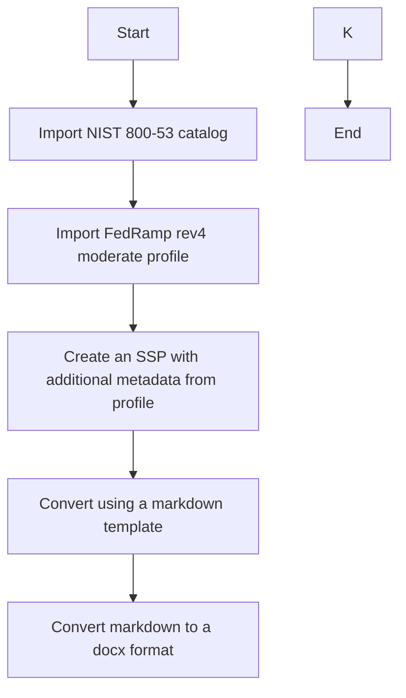

# trestle-demo

This demo repository illustrates how to use [compliance-trestle](https://ibm.github.io/compliance-trestle/) to enable continuous compliance workflows.

## Authoring

The demonstrates the authoring workflows using the `generate-edit-assemble` steps recommended by the `compliance-trestle` documentation.

### Proposed Authoring CI Workflow

Workflows can be demonstrated by using `make` targets.

These will demonstrate the `generate-edit-assemble` workflow

When pull requests are submitted, based on the path that edited content is located in, certain validation pipelines will
be run to ensure markdown and json content is in sync and all OSCAL documents are valid.

Once content has been merged, a pipeline will run to regenerate dependent components and submit PRs when applicable.
This allows for pull request to encompass certain OSCAL models and dependent changes can be detected and submitted into a new pull request for
other personas to review.

This repository does not use CODEOWNERS to delegate permissions to certain groups, but that is a solution for allowing the 
different personas control of their applicable OSCAL content.

## Evidence Collection

## Reporting

## Required Components

- `docker` or `podman`
- `make`
- `git`

## Workflows

### FedRamp SSP Authoring

#### Diagram

#### Usage

To use the container with all the required dependencies, run `make demo-build` and `make sandbox-run`

To move to the workspace run `cd trestle-workspace`

Run `make generate=ssp-word` to run the entire workflow. This will generate a markdown SSP and convert it to the docx format.
To just generate the markdown run `make generate-ssp-markdown`

If starting from scratch or testing changes to the SSP:

Run `make bootstrap-workspace` to import the NIST catalog and FedRamp profile
Run `make generate-fedramp-ssp` to generate the SSP markdown files under `markdown/system-security-plans`

> If changes are made to the SSP markdown, run `make assemble-ssps`

