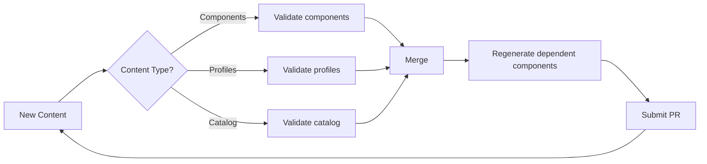

# trestle-demo

## Proposed Authoring Workflow

```mermaid
graph LR;
A[New Content]-->B{Content Type?};
B -- Catalog --> C[Validate catalog]
B -- Profiles --> D[Validate profiles]
B -- Components --> E[Validate components]
E --> G[Merge]
D --> G
C --> G
G --> H[Regenerate dependent components]
H --> I[Submit PR]
I --> A
```