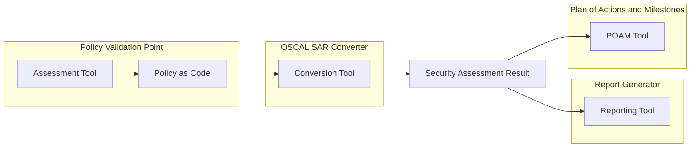

# Assessment Workflow

**Note: The assessment workflow is not implemented by this demo yet. This is due to lack of mature tooling for interacting with content in the [OSCAL Assessment Layer](https://pages.nist.gov/OSCAL/concepts/layer/assessment/) Models.**

## Description

The Policy Validation Point (PVP) uses an assessment tool to evaluate the system's compliance with the defined security policies. This process involves executing the policy-as-code to automatically check the system's security controls.

Once the PVP has conducted the assessment, the results are converted into an OSCAL Security Assessment Result (SAR) using a dedicated conversion tool. The SAR is a machine-readable format that captures the assessment findings, including the status of the evaluated security controls and any identified deficiencies.

The SAR can then be used to generate a human-readable report using a report generation tool. This report provides a comprehensive view of the assessment findings and can be used by various stakeholders, such as security engineers, auditors, and system owners, to review and analyze the system's security posture.

Alternatively, the SAR can be imported into an OSCAL Plan of Actions and Milestones (POAM) using a dedicated tool. The POAM tracks and manages risk mitigation efforts, ensuring that identified deficiencies are addressed in a timely manner.

