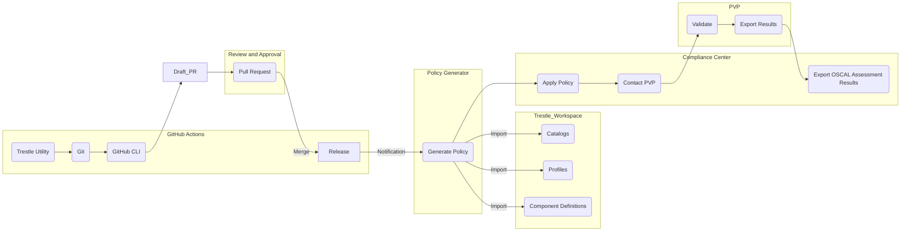

# Compliance to Policy Workflow

This diagram details the workflow from `compliance-trestle` to an operational compliance center to detail how system compliance posture can be evaluated.

```mermaid
 graph LR
    subgraph Trestle_Workspace
        Catalogs(Catalogs)
        Profiles(Profiles)
        Component_Definitions(Component Definitions)
    end
    subgraph GitHub Actions
        Trestle_Utility(Trestle Utility)
        Git(Git)
        GitHub_CLI(GitHub CLI)
        Release
    end
    subgraph Policy Generator
        Generate_Policy(Generate Policy)
    end
    subgraph Compliance Center
        Apply_Policy(Apply Policy)
        Contact_PVP(Contact PVP)
        Export_OSCAL_AR(Export OSCAL Assessment Results)
    end
    subgraph PVP
        Validate(Validate)
        Export(Export Results)
    end
    subgraph Review and Approval
        Pull_Request(Pull Request)
    end

    Pull_Request -- Merge --> Release
    Trestle_Utility --> Git
    Git --> GitHub_CLI
    GitHub_CLI --> Draft_PR
    Draft_PR --> Pull_Request
    Release -- Notification --> Generate_Policy
    Generate_Policy -- Import --> Component_Definitions
    Generate_Policy -- Import --> Catalogs
    Generate_Policy -- Import --> Profiles
    Generate_Policy --> Apply_Policy
    Apply_Policy --> Contact_PVP
    Contact_PVP --> Validate
    Validate --> Export
    Export --> Export_OSCAL_AR
```
