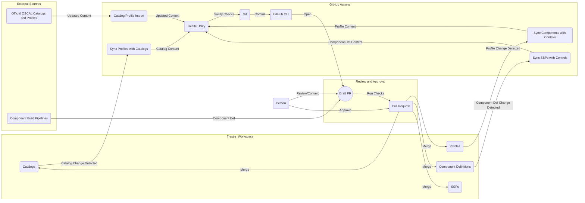

# Component Diagrams

## Importing and Authoring Workflow

When any content in the OSCAL Control and Implementation layers is updated, the change to its respective model's content is detected by GitHub Actions and propagated to the models importing the changes. Each time a synchronization action occurs, after GitHub Actions has updated the content within an OSCAL model, GitHub Actions opens a Draft Pull Request with the content modifications to the `compliance-trestle` workspace, which is then reviewed and converted to a Pull Request by an authorized user. The Pull Request is then conditionally approved by an authorized user and merged into the `compliance-trestle` workspace. When the updated content from the merge is detected by GitHub Actions, the process repeats until the SSP content is merged. 

## Reporting Workflow

Reports at varying levels of granularity can be generated from SSPs by referencing Jinja templates that act as content filters. Optional front matter can also be referenced to provide additional context for the report. These items are then processed by the trestle utility with the referenced OSCAl content and output in various formats such as markdown and docx. 

