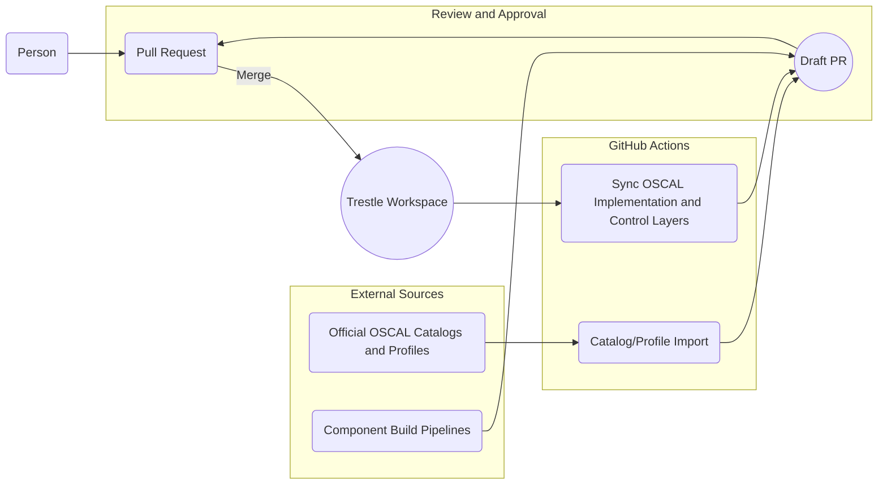
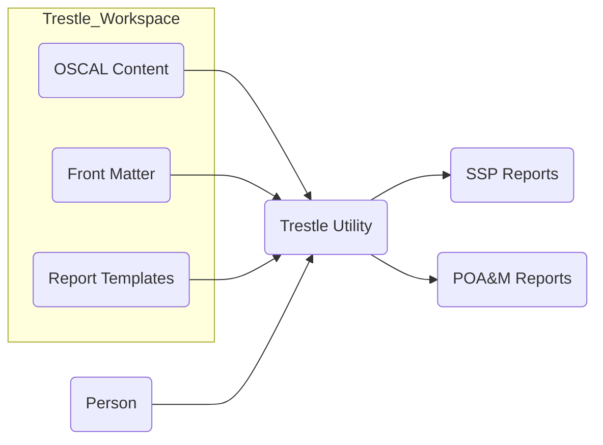
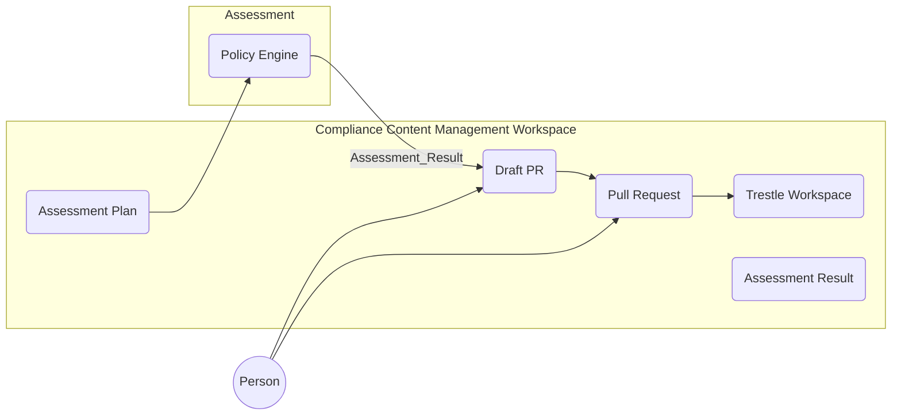

# Container Diagrams

## Importing/Authoring Workflow

Trestle workspace content is updated by one of three inputs:

1. Human authoring and submission via PR. 

2. External machine agent opens draft PR

3. GitHub Actions polling of authoritative sources opens draft PR when updates are found. 

## Reporting Workflow

Trestle can be used to generate custom reports from OSCAL formatted content by referencing templates and optional additional front-matter. A user interacts with the trestle utility to generate these reports in various formats. 

## Assessment Workflow

