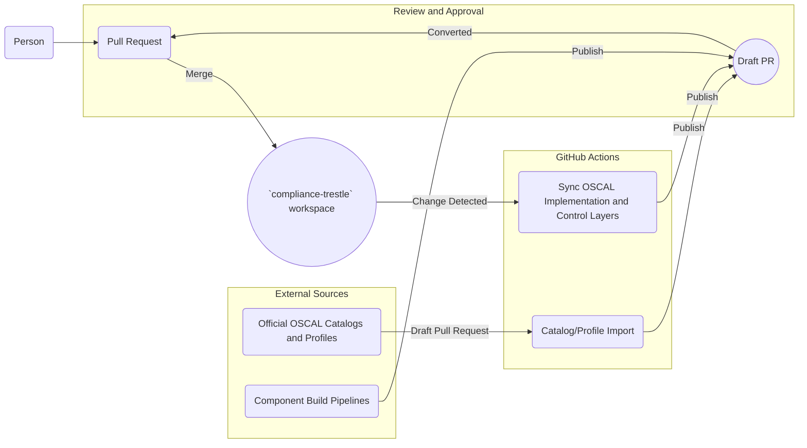
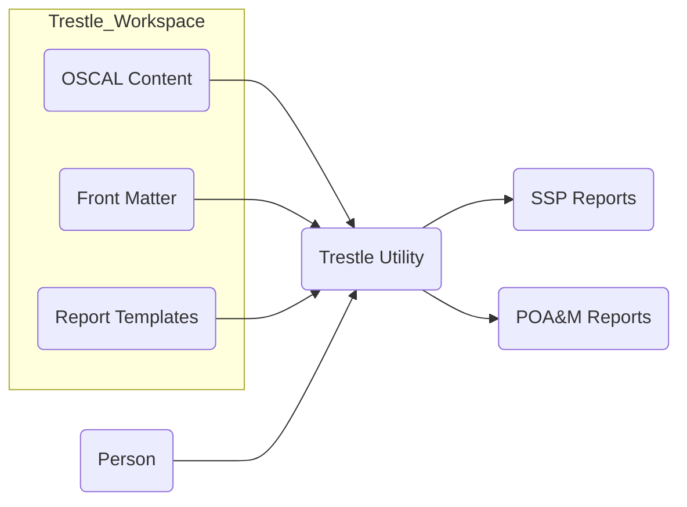
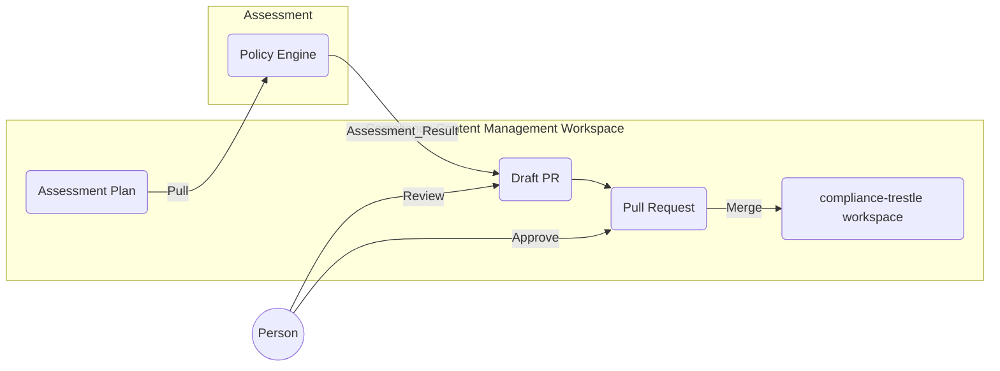

# Container Diagrams

## Importing/Authoring Workflow

`compliance-trestle` workspace content is updated by one of three inputs:

1. Human authoring and submission via pull request (PR). 

2. External machine agent opens draft PR

3. GitHub Actions polling of authoritative sources opens draft PR when updates are found. 

Once `compliance-trestle` workspace content modifications have been merged into the `compliance-trestle` workspace, a series of synchronization actions are performed on the `compliance-trestle` workspace with GitHub Actions. GitHub Actions opens a Draft PR on the `compliance-trestle` workspace as an step between each synchronization action. An authorized user reviews the Draft PRs

## Reporting Workflow

The `compliance-trestle` utility can be used to generate custom reports from OSCAL formatted content by referencing templates and optional additional front-matter. A user interacts with the trestle utility to generate these reports in various formats. 

## Assessment Workflow

OSCAL Assessment Plans are imported to a policy agent from the `compliance-trestle` workspace. Once the policy agent has performed its assessment as per the Assessment Plan, it produces an Assessment Result and exports the Assessment Result to the `compliance-trestle` workspace as a Draft PR. An authorized user then reviews the Draft PR, converts it to a Pull Request, and then conditionally approves it to be merged into the `compliance-trestle` workspace. 

