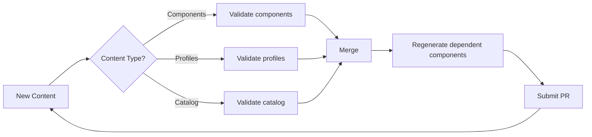
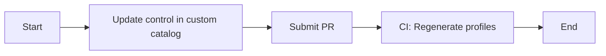
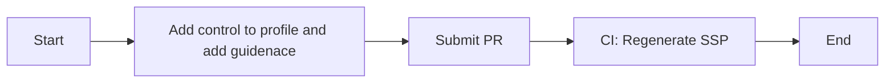
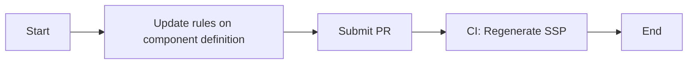
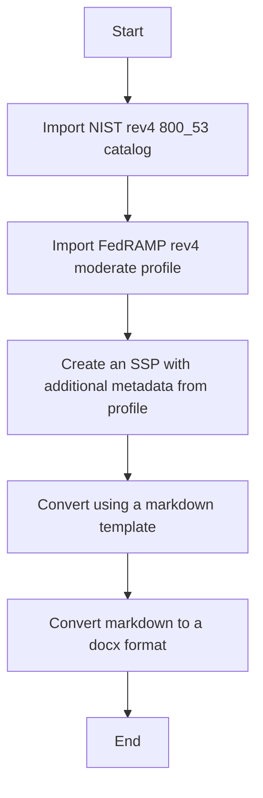

Getting Started Guide
---

<!--toc-->
- [What You Will Learn](#what-you-will-learn)
- [Tools Required](#tools-required)
- [Setting up Your Repository](#setting-up-your-repository)
- [Editing Content](#editing-content)
- [Personas and Applicable Workflows](#personas-and-applicable-workflows)
    * [Control Issuers](#control-issuers)
        * [Applicable Workflows](#applicable-workflows)
            * [What's included](#whats-included)
            * [Diagram](#diagram)
            * [Steps](#steps)
    * [Control Owners](#control-owners)
        * [Applicable Workflows](#applicable-workflows-1)
            * [What's included](#whats-included-1)
            * [Diagram](#diagram-1)
            * [Steps](#steps-1)
    * [Control Providers](#control-providers)
        * [Applicable Workflows](#applicable-workflows-2)
            * [What's included](#whats-included-2)
            * [Diagram](#diagram-2)
            * [Steps](#steps-2)
    * [Control Assessors](#control-assessors)
        * [Applicable Workflows](#applicable-workflows-3)
    * [Control Operators (System Owners)](#control-operators-system-owners)
        * [Applicable Workflows](#applicable-workflows-4)
            * [What's included?](#whats-included-3)
            * [Diagram](#diagram-3)
            * [Steps](#steps-3)
    * [Additional Resources](#additional-resources)

<!-- tocstop -->

This guide provides an overview of this demo project including everything that you need to get started from obtaining the necessary tooling to running workflows.

# What You Will Learn

- How to Set up the Repository
- Instruction for Content Editing
- Personas and Workflows

# Tools Required

- [`docker`](https://docs.docker.com/get-docker/) or [`podman`](https://podman.io/getting-started/installation)
- `make`
- `git`
- [`GitHub CLI`](https://github.com/cli/cli/blob/trunk/docs/install_linux.md) - optional

# Setting up Your Repository

This repository is meant to be used as a template to ensure your repository environment has all required content and a separate commit history. 
Use this [guide](https://docs.github.com/en/repositories/creating-and-managing-repositories/creating-a-repository-from-a-template) to create a repository.
If you don't have a GitHub Team, GitHub Enterprise Cloud or GitHub Enterprise Server plan, make sure the repository visibility is public so draft pull requests can be submitted.

Here are some additional resources for repository configuration:

- [Branch Protection](https://docs.github.com/en/repositories/configuring-branches-and-merges-in-your-repository/defining-the-mergeability-of-pull-requests/managing-a-branch-protection-rule)
- [GitHub Actions Configuration](https://docs.github.com/en/repositories/managing-your-repositorys-settings-and-features/enabling-features-for-your-repository/managing-github-actions-settings-for-a-repository)

# Editing Content

This demo shows the authoring workflows using the `generate-edit-assemble` steps recommended by the `compliance-trestle` documentation.

### What does `generate-edit-assemble` mean?

The first step in finishing edits on OSCAL content is to run commands to generate Markdown from the OSCAL models.

The following commands can be run to generate this:

- `make regenerate-catalogs`
- `make regenerat-profiles`
- `make regenerate-cd`
- To regenerate all: `make regenerate`

To generate an SSP from a profile and component definitions, use the following command:

`trestle author ssp-generate --profile profile_name --compdefs "compdef_a,compdef_b" --output markdown/my_ssp`

The generated Markdown is located in `markdown` directory. Each control is stored in its own file, and it is these files that should be edited.

For more structured content, such as control parameters, the YAML header is used, whereas control statements and guidance are represented using a specific Markdown format. Users must adhere to this format in order for `compliance-trestle` to properly convert Markdown files back into JSON format.

When the edits are finished, the Markdown can be reassembled into the OSCAL models using the commands listed below.:

- `make assemble-catalogs`
- `make assemble-profiles`
- `make assemble-cd`
- To assemble all: `make assemble`

For more information on the `trestle` commands used, please see the `compliance-trestle` [documentation](https://ibm.github.io/compliance-trestle/tutorials/ssp_profile_catalog_authoring/ssp_profile_catalog_authoring/) around authoring.

# Personas and Applicable Workflows

The workflows that follow outline the content editing activities based on persona. The diagram below depicts the overall workflow when edited content is submitted to the git repository as a pull request.

When pull requests are submitted, certain validation pipelines will be run based on the path that edited content is located in to ensure Markdown and JSON content is in sync and all OSCAL documents are valid.

Once the content has been merged, a pipeline will be started to regenerate dependent components and submit pull requests as needed.
This enables pull requests to include specific OSCAL models, and dependent changes can be detected and submitted into a new pull request for review by other personas.

Note that this git repository configuration deviates from the `compliance-trestle` repository [story](https://dzone.com/articles/compliance-automated-standard-solution-compass-part-3-artifacts-and-personas) to support a demonstration environment. 
Multiple repositories allow for a separation in managed content by persona. To delegate permissions by persona for the content in a single repository, a [CODEOWNERS](https://docs.github.com/en/repositories/managing-your-repositorys-settings-and-features/customizing-your-repository/about-code-owners) file can be used.



## Control Issuers

> Applicable OSCAL model: Catalogs

Control issuers are regulators who oversee the management of control elements in an OSCAL catalog. 
Control information can also be provided in human-readable formats such as PDF and then converted to an OSCAL catalog using a `trestle` transformer.

### Applicable Workflows

In this workflow, we will edit an existing catalog and see how those changes are propagated downstream to OSCAL profiles.

#### What's included

- The custom control catalog. The prose for the control statements can be added and removed through the `markdown/catalogs/ACME_custom_controls` directory.
- The ACME custom profile imports the custom catalog as well as the NIST rev5 800 53 catalog. Parameters can be set and additional guidance can be provided in `markdown/profiles/ACME_custom_profile`.

#### Diagram



#### Steps

Clone your repository create from the template to your local environment to get started.

```bash
git clone https://github.com/mynamespace/my-trestle-repo
```

If necessary, create the container image and run the container. Because the local repository is mounted as a volume under `trestle-workspace`, making changes requires you to navigate to that directory.

```bash
make demo-build # build the container image if not done already
make sandbox-run
cd trestle-workspace
````

To make changes to the ACME custom controls catalog, checkout a new branch.

```bash
git checkout -b "feat/adds-cc-3"
```

Now that the workspace and all dependencies are available, we can make changes to the ACME custom controls catalog to demonstrate how new or updated controls are propagated to dependent OSCAL profiles.

To create a new control, create a file called `cc-3.md` in the ACME custom controls catalog markdown directory.

```bash
cat << EOF > ./markdown/catalogs/ACME_custom_controls/cc/cc-3.md
# cc-3 - \[Custom Controls\] Test reporting

## Control Statement

All services must run my test.
EOF
```

Run the `assemble-catalogs` command to ensure that the Markdown changes are reflected in the OSCAL catalog.

```bash
make assemble-catalogs
```

When you run `git status` ,you should see two file changes. One in the `markdown/catalogs` directory, the other in the `catalogs` directory.

Using the GitHub CLI, you can now commit the changes to the branch and create a pull request. You can also use the [GitHub UI](https://docs.github.com/en/pull-requests/collaborating-with-pull-requests/proposing-changes-to-your-work-with-pull-requests/creating-a-pull-request) to create a pull request.

```bash
git add markdown/ catalogs/
git commit -m "feat: adds-cc-3"
git push -u origin "feat/adds-cc-3"
gh pr create -t "feat/adds-cc-3" -b "Adds cc-3 to ACME custom catalog" -B "main" -H "feat/adds-cc-3"
```

View the pull request with the GitHub CLI and merge it when finished.

```bash
gh pr view
gh pr merge
```

When this pull request is merged, a workflow is started to detect changes to the profiles, and a new pull request is submitted. Wait for the pull request to be submitted before inspecting the changes. Mark the pull request as ready for review to allow the CI workflow to run.

```bash
watch gh pr list
gh pr diff 2 --web # Use web to open a web browser.
gh pr ready 2
```

View the pull request with the GitHub CLI and merge it when finished.

```bash
gh pr view 2
gh pr merge 2
```

See the recorded steps for this demo [here](./recordings)

## Control Owners

> Applicable OSCAL model: Profiles

Control owners can add additional control guidance and use controls from one or more catalogs to create a tailored subset of controls for a specific use-case.
Profiles can be based on other profiles as well.

### Applicable Workflows

In this workflow, we will provide additional guidance on a control imported by a profile to update the resolve profile catalog. This update will propagate to a system security plan that is based on the existing profile.

#### What's included

- The ACME custom profile imports the custom catalog as well as the NIST rev5 800 53 catalog. Parameters can be set and additional guidance can be provided in `markdown/profiles/ACME_custom_profile`
- The ACME internal profile imports the ACME custom profile. Parameters can be set and additional guidance can be provided in `markdown/profiles/ACME_internal_profile`
- The ACME custom SSP (partial) is based on the ACME internal profile. Is it located `markdown/system-security-plans/acme_demo_custom_ssp`

#### Diagram



#### Steps

Clone your repository create from the template to your local environment to get started.

```bash
git clone https://github.com/mynamespace/my-trestle-repo
```

If necessary, create the container image and run the container. Because the local repository is mounted as a volume under `trestle-workspace`, making changes requires you to navigate to that directory.

```bash
make demo-build # build the container image if not done already
make sandbox-run
cd trestle-workspace
````

To make changes to the ACME custom profile, checkout a new branch.

```bash
git checkout -b "feat/adds-custom-guidance"
```

Now that the workspace and all dependencies are available, we add additional guidance to a control in the ACME custom profile.

To add additional guidance to an existing control, add information under a "## Control" heading to the end of the `pr-1.md` file.

```bash
cat << EOF >> ./markdown/profiles/ACME_custom_profile/pr/pr-1.md

## Control additional_process_guidance

The process automation must be documented in Markdown.
EOF
```

Run the `assemble-profiles` command to ensure that the Markdown changes are reflected in the OSCAL profile.

```bash
make assemble-profiles
```

When you run `git status` , you should see two file changes. One in the `markdown/profiles` directory, the other in the `profiles` directory.

Using the GitHub CLI, you can now commit the changes to the branch and create a pull request. You can also use the [GitHub UI](https://docs.github.com/en/pull-requests/collaborating-with-pull-requests/proposing-changes-to-your-work-with-pull-requests/creating-a-pull-request) to create a pull request.

```bash
git add markdown/ profiles/
git commit -m "feat: adds-custom-guidance"
git push -u origin "feat/adds-custom-guidance to cc-3"
gh pr create -t "feat/adds-custom-guidance" -b "Adds guidance to control in custom profile" -B "main" -H "feat/adds-custom-guidance"
```

View the pull request with the GitHub CLI and merge it when finished.

```bash
gh pr view
gh pr merge
```

When this pull request is merged, a workflow is started to detect changes to the system security plan, and a new pull request is submitted. Wait for the pull request to be submitted before inspecting the changes. Mark the pull request as ready for review to allow the CI workflow to run.

```bash
watch gh pr list
gh pr diff 2 --web # Use web to open a web browser.
gh pr ready 2
```

View the pull request with the GitHub CLI and merge it when finished.

```bash
gh pr view 2
gh pr merge 2
```

See the recorded steps for this demo [here](./recordings)

## Control Providers

> Applicable OSCAL Model: Component Definitions

Control providers use component definitions to capture technology-specific implementation and control responses to allow adherence to be programmatically verified. Rules are provided using CSV and
control responses are provided in the Markdown format.

### Applicable Workflows

In this workflow, we will add a rule to the CSV file to update the control implementation for the `hello-world` component.

#### What's included

- The hello-world.csv under the `rules` directory with example rules for the ACME internal profile
- An existing Hello World component definition with one rule identified. Control implementation information can be edited under `markdown/components/hello-world-custom`
- The ACME custom SSP (partial) imports the Hello World Component. Is it located `markdown/system-security-plans/acme_demo_custom_ssp`

#### Diagram



#### Steps

Clone your repository create from the template to your local environment to get started.

```bash
git clone https://github.com/mynamespace/my-trestle-repo
```

If necessary, create the container image and run the container. Because the local repository is mounted as a volume under `trestle-workspace`, making changes requires you to navigate to that directory.

```bash
make demo-build # build the container image if not done already
make sandbox-run
cd trestle-workspace
````

To make changes to the Hello World component definition, checkout a new branch.

```bash
git checkout -b "feat/adds-rule-to-cc-1"
```

Now that the workspace and all dependencies are available, we can make changes to the Hello World custom component definition.

To create a new rule, update the `hello-world.csv` file under the `rules` directory. 
Open the CSV and copy the first row. Change the rule_id in Column D, the rule description in Column E, and change the control_id in column L to cc-1.


Run the `update-cd` and `regenerate-cd` commands to ensure that the rule changes are reflected in the component Markdown.

```bash
make update-cd
make regenerate-cd
```

When you run `git status`, you should see a file addition under the `markdown/components/hello-world-custom/Hello World` directory.
Navigate to the new Markdown file in the directory and add a control implementation details.

Run the `assemble-cd` command to ensure that the Markdown changes are reflected in the OSCAL component definitions. 

```bash
make assemble-cd
```

When you run `git status` for a second time, you should see two file changes. One in the `markdown/components` directory, the other in the `component-definitions` directory.

Using the GitHub CLI, you can now commit the changes to the branch and create a pull request. You can also use the [GitHub UI](https://docs.github.com/en/pull-requests/collaborating-with-pull-requests/proposing-changes-to-your-work-with-pull-requests/creating-a-pull-request) to create a pull request.

```bash
git add markdown/ component-defintions/ rules/
git commit -m "feat: adds rule to cc-1"
git push -u origin "feat/adds-rule-to-cc-1"
gh pr create -t "feat/adds-rule-to-cc-1" -b "Adds a rule for control CC-1" -B "main" -H "feat/adds-rule-to-cc-1"
```

View the pull request with the GitHub CLI and merge it when finished.

```bash
gh pr view
gh pr merge
```

When this pull request is merged, a workflow is started to detect changes to the profiles, and a new pull request is submitted. Wait for the pull request to be submitted before inspecting the changes. Mark the pull request as ready for review to allow the CI workflow to run.

```bash
watch gh pr list
gh pr diff 2 --web # Use web to open a web browser.
gh pr ready 2
```

View the pull request with the GitHub CLI and merge it when finished.

```bash
gh pr view 2
gh pr merge 2
```

See the recorded steps for this demo [here](./recordings)

## Control Assessors

> Applicable OSCAL Model: Component Definitions and Assessment Results

Control Assessors will require knowledge of rule-to-check mappings. 
Currently, policy rules and checks are not a first-class field in OSCAL Component Definitions. 
Component properties, on the other hand, can be used to include rule-id and check-id for system evaluation. The component definition data can be fed into the policy engine to generate OSCAL Assessment Results.

### Applicable Workflows

Workflows are currently not available for this persona.

## Control Operators (System Owners)

> Applicable OSCAL Model: System Security Plans

Control Operators provide control responses for the overall system to auditors using the OSCAL System Security Plan (SSP). Using `compliance-trestle`, a partial 
SSP is generated from a given profile and component definitions.

### Applicable Workflows

Reporting workflows can be demonstrated by using pre-defined `make` targets. 
In this workflow, we generate an OSCAL system security plan based on the FedRAMP Moderate profile and use it to populate a single Markdown file and FedRAMP docx template.

#### What's included?

- The NIST rev4 800_53 catalog
- The FedRAMP Moderate profile
- The profile has been updated so the import href points within the trestle project to trestle://catalogs/nist_rev4_800_53/catalog.json

#### Diagram



> Note: The workspace is pre-populated with the catalog and profile so the first two steps in the diagram are skipped.

#### Steps

Clone your repository create from the template to your local environment to get started.

```bash
git clone https://github.com/mynamespace/my-trestle-repo
```

If necessary, create the container image and run the container. Because the local repository is mounted as a volume under `trestle-workspace,` making changes requires you to navigate to that directory.

```bash
make demo-build # build the container image if not done already
make sandbox-run
cd trestle-workspace
````

Run `make generate-ssp-word` to run the entire workflow. This will generate a Markdown system security plan and convert it to the docx format.
To just generate the Markdown run `make generate-ssp-markdown`

If starting from scratch or testing changes to the system security plan:

Run `make bootstrap-workspace` to import the NIST 800-53 catalog and FedRAMP Moderate profile.
Run `make generate-fedramp-ssp` to generate the system security plan Markdown file under `markdown/system-security-plans`

> If changes are made to the system security plan in Markdown, run `make assemble-ssps`

## Additional Resources

- Learn more about [compliance-trestle](https://ibm.github.io/compliance-trestle/)
- Learn more about [OSCAL](https://pages.nist.gov/OSCAL/)
- Learn more about the Trestle repository and compliance [story](https://dzone.com/articles/compliance-automated-standard-solution-compass-part-3-artifacts-and-personas)


