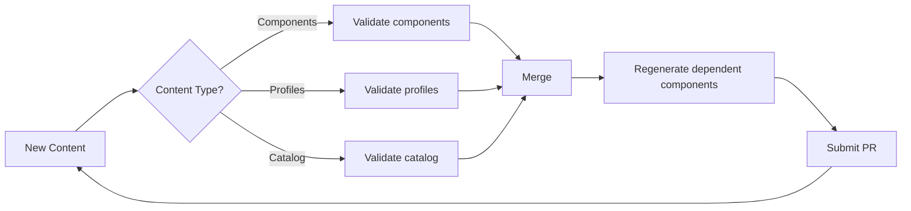
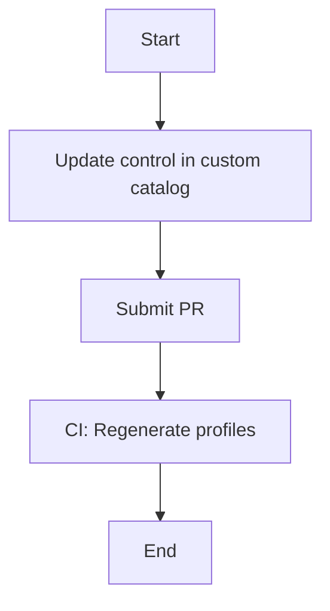
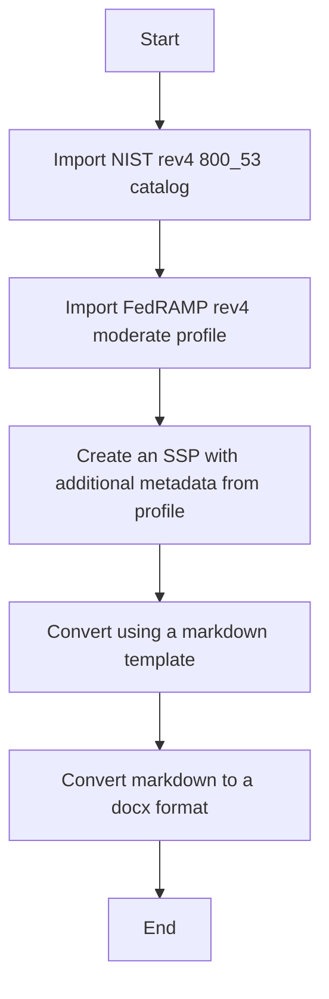

# Getting Started Guide

This guide provides an overview of this demo project including everything that you need to get started from obtaining the necessary tooling to running workflows.

# What You Will Learn

- How to Set up the Repository
- Instruction for Content Editing
- GitHub Actions Workflows
- Reporting Workflows

## Tools Required

- [`docker`](https://docs.docker.com/get-docker/) or [`podman`](https://podman.io/getting-started/installation)
- `make`
- `git`
- [`GitHub CLI`](https://github.com/cli/cli/blob/trunk/docs/install_linux.md) - optional

## Setting up Your Repository

This repository is meant to be used as a template to ensure your repository environment has all required content and a separate commit history. 
Use this [guide](https://docs.github.com/en/repositories/creating-and-managing-repositories/creating-a-repository-from-a-template) to create a repository.
If you don't have a GitHub Team, GitHub Enterprise Cloud or GitHub Enterprise Server plan, make sure the repository visibility is public so draft pull requests can be submitted.

Here are some additional resources for repository configuration:

- [Branch Protection](https://docs.github.com/en/repositories/configuring-branches-and-merges-in-your-repository/defining-the-mergeability-of-pull-requests/managing-a-branch-protection-rule)
- [GitHub Actions Configuration](https://docs.github.com/en/repositories/managing-your-repositorys-settings-and-features/enabling-features-for-your-repository/managing-github-actions-settings-for-a-repository)

## Editing Content

This demo shows the authoring workflows using the `generate-edit-assemble` steps recommended by the `compliance-trestle` documentation.

What does `generate-edit-assemble` mean?

The first step in finishing edits on OSCAL content is to run commands to generate markdown from the OSCAL models.

The following commands can be run to generate this:

- `make regenerate-catalogs`
- `make regenerat-profiles`
- `make regenerate-cd`
- To regenerate all: `make regenerate`

To generate an SSP from a profile and component definitions, use the following command:

`trestle author ssp-generate --profile profile_name --compdefs "compdef_a,compdef_b" --output markdown/my_ssp`

The generated markdown is located in `markdown` directory. Each control is stored in its own file, and it is these files that should be edited.

When the edits are finished, the markdown can be reassembled into the OSCAL models using the commands listed below.:

- `make assemble-catalogs`
- `make assemble-profiles`
- `make assemble-cd`
- To assemble all: `make assemble`

For more information on the `trestle` commands used, please see the `compliance-trestle` [documentation](https://ibm.github.io/compliance-trestle/tutorials/ssp_profile_catalog_authoring/ssp_profile_catalog_authoring/) around authoring.

## Running GitHub Actions Workflows

To test markdown generation, edit them, and then reassemble them using the commands outlined above.

When pull requests are submitted, certain validation pipelines will be run based on the path that edited content is located in to ensure markdown and json content is in sync and all OSCAL documents are valid.

Once the content has been merged, a pipeline will be started to regenerate dependent components and submit pull requests as needed.
This enables pull requests to include specific OSCAL models, and dependent changes can be detected and submitted into a new pull request for review by other personas.

This repository does not use CODEOWNERS to delegate permissions to certain groups, but that is a solution for allowing the
different personas control of their applicable OSCAL content.



### Custom Catalog Update

#### What's included

- The custom control catalog. The prose for the control statements can be added and removed through the `markdown/catalogs/ACME_custom_controls` directory
- The ACME custom profile imports the custom catalog as well as the NIST rev5 800 53 catalog. Parameters can be set and additional guidance can be provided in `markdown/profiles/ACME_custom_profile`

#### Diagram



#### Steps

Clone your repository create from the template to your local environment to get started.

```bash
git clone https://github.com/mynamespace/my-trestle-repo
```

If necessary, create the container image and run the container. Because the local repository is mounted as a volume under 'trestle-workspace,' making changes requires you to navigate to that directory.

```bash
make demo-build # build the container if not done already
make sandbox-run
cd trestle-workspace
````

To make changes to the ACME custom controls catalog, checkout a new branch.

```bash
git checkout -b "feat/adds-cc-3"
```

Now that the workspace and all dependencies are available, we can make changes to the ACME custom controls catalog to demonstrate how new or updated controls are propagated to dependent OSCAL profiles.

To create a new control, create a file called 'cc-3.md' in the ACME custom controls catalog markdown directory.

```bash
cat << EOF > ./markdown/catalogs/ACME_custom_controls/cc/cc-3.md
# cc-3 - \[Custom Controls\] Test reporting

## Control Statement

All services must run my test.
EOF
```

Run the `assemble-catalogs` command to ensure that the markdown changes are reflected in the OSCAL catalog.

```bash
make assemble-catalogs
```

When you run 'git status,' you should see two file changes. One in the markdown/catalogs directory, the other in the 'catalogs' directory.

Using the GitHub CLI, you can now commit the changes to the branch and create a pull request. You can also use the [GitHub UI](https://docs.github.com/en/pull-requests/collaborating-with-pull-requests/proposing-changes-to-your-work-with-pull-requests/creating-a-pull-request) to create a pull request.

```bash
git commit -m "feat/adds-cc-3"
git push -u origin "feat/adds-cc-3"
gh pr create -t "feat/adds-cc-3" -b "Adds cc-3 to ACME custom catalog" -B "main" -H "feat/adds-cc-3"
```

View the pull request with the GitHub CLI and merge it when finished.

```bash
gh pr view
gh pr merge
```

When this pull request is merged, a workflow is started to detect changes to the profiles, and a new pull request is submitted. Wait for the pull request to be submitted before inspecting the changes. Mark the pull request as ready for review to allow the CI workflow to run.

```bash
watch gh pr list
gh pr diff 2 --web # Use web to open a web browser.
gh pr ready 2
```

View the pull request with the GitHub CLI and merge it when finished.

```bash
gh pr view 2
gh pr merge 2
```

See the recorded steps for this demo [here](./recordings)

## Running Reporting Workflows

Reporting workflows can be demonstrated by using pre-defined `make` targets.

### FedRAMP System Security Plan (SSP) Authoring

#### What's included?

- The NIST rev4 800_53 catalog
- The FedRAMP Moderate profile
- The profile has been updated so the import href points within the trestle project to trestle://catalogs/nist_rev4_800_53/catalog.json

#### Diagram



#### Usage

To use the container with all the required dependencies, run `make demo-build` and `make sandbox-run`

To move to the workspace run `cd trestle-workspace`

Run `make generate-ssp-word` to run the entire workflow. This will generate a markdown system security plan and convert it to the docx format.
To just generate the markdown run `make generate-ssp-markdown`

If starting from scratch or testing changes to the system security plan:

Run `make bootstrap-workspace` to import the NIST 800-53 catalog and FedRAMP Moderate profile.
Run `make generate-fedramp-ssp` to generate the system security plan markdown file under `markdown/system-security-plans`

> If changes are made to the system security plan markdown, run `make assemble-ssps`

## Additional Resources

- Learn more about [compliance-trestle](https://ibm.github.io/compliance-trestle/)
- Learn more about [OSCAL](https://pages.nist.gov/OSCAL/)


