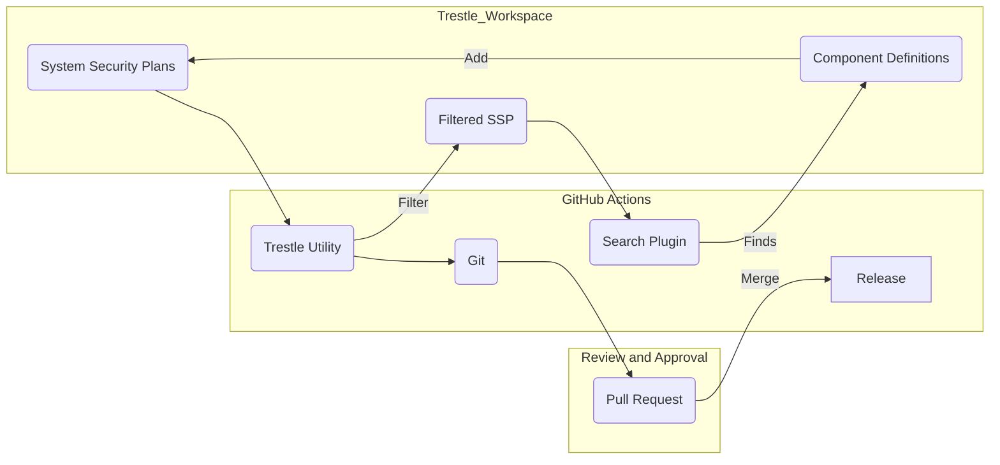
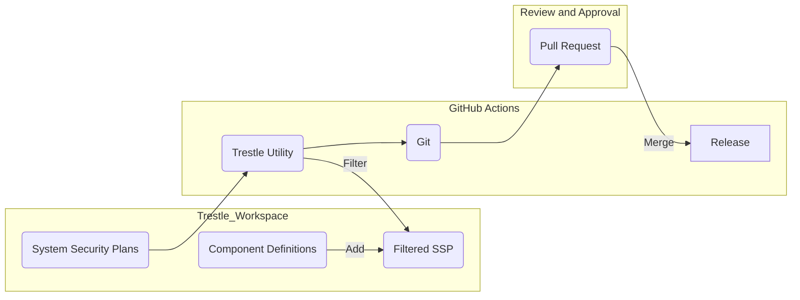

# SSP Filtering Workflow

This diagram details the workflow for SSP filtering use cases with `compliance-trestle`.

## SSP Filter for Gap Analysis

By filtering on control implementation status information, this diagram depicts a process that could be used to find gaps in implemented control in an SSP.

## SSP Filter for Component Maintenance

This diagram depicts a process that could be used to either scope SSPs by components in order to update implementation information for a new component, 
or to allow a filtered SSP to serve as a starting point for a new SSP with similar control and components.

